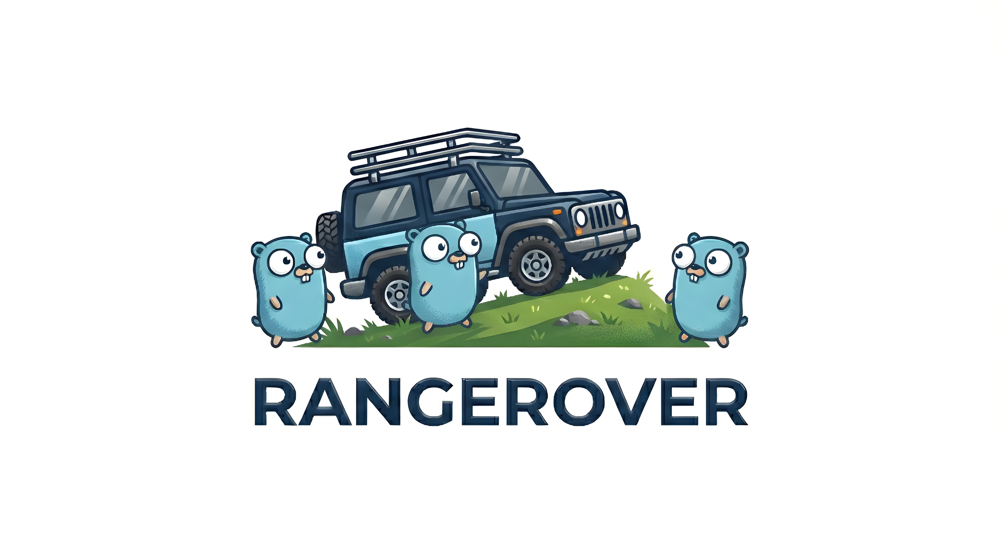

<div align="center">
  
  
  # RangeRover
  
  **A high-performance, parallel file downloader written in Go**
  
  [](https://go.dev/)
  [](https://opensource.org/licenses/MIT)
  [](http://makeapullrequest.com)
  
</div>

---

## 📖 Overview

RangeRover is a lightweight, command-line file downloader that accelerates downloads by splitting files into multiple chunks and fetching them in parallel using Goroutines and HTTP Range requests. Perfect for downloading large files efficiently.

### ✨ Key Features

- **⚡ Parallel Downloads** - Utilizes multiple Goroutines to download file chunks concurrently
- **🔄 HTTP Range Requests** - Intelligently splits files by inspecting headers and using byte-range requests
- **🛡️ Automatic Retry Logic** - Configurable retry mechanism for failed downloads
- **⚙️ Customizable Chunk Size** - Fine-tune chunk sizes for optimal performance
- **📊 Worker Control** - Limit concurrent connections to respect server resources
- **🚀 Zero Dependencies** - Built with Go's standard library for minimal footprint
- **💻 Simple CLI** - Easy-to-use command-line interface

---

## 🚀 Installation

### Prerequisites

- Go 1.25.3 or higher

### Install from Source

```bash
git clone https://github.com/standard-librarian/rangerover.git
cd rangerover
go build -o rangerover
```

### Quick Install

```bash
go install github.com/standard-librarian/rangerover@latest
```

---

## 📋 Usage

### Basic Syntax

```bash
rangerover -url <URL> -dist <DESTINATION> [OPTIONS]
```

### Command-Line Options

| Flag | Description | Default | Example |
|------|-------------|---------|---------|
| `-url` | URL of the file to download | **(required)** | `https://example.com/file.zip` |
| `-dist` | Destination path for the downloaded file | **(required)** | `./downloads/file.zip` |
| `-n` | Number of parallel Goroutines (workers) | `1` | `4` |
| `-s` | Maximum chunk size in bytes | `1048576` (1MB) | `2097152` (2MB) |
| `-r` | Number of retry attempts for failed chunks | `3` | `5` |

### Examples

#### Basic Download
```bash
rangerover -url https://example.com/file.zip -dist ./downloads/file.zip
```

#### High-Performance Download with 8 Workers
```bash
rangerover -url https://example.com/largefile.iso -dist ./largefile.iso -n 8
```

#### Custom Chunk Size and Retries
```bash
rangerover -url https://cdn.example.com/video.mp4 -dist ./video.mp4 -n 4 -s 2097152 -r 5
```

#### Using Make (Development)
```bash
# Run with default parameters
make run-args

# Run with custom parameters
make run-args URL=https://example.com/file.zip DIST=./myfile.zip N=8

# Show help
make run-help
```

---

## 🏗️ Architecture

RangeRover follows a simple yet efficient architecture:

1. **Header Inspection** - Sends a HEAD request to check if the server supports Range requests
2. **Chunk Calculation** - Divides the file into optimal chunks based on file size and chunk size
3. **Parallel Download** - Spawns multiple Goroutines to download chunks concurrently
4. **File Assembly** - Writes chunks to their correct positions in the destination file
5. **Retry Mechanism** - Automatically retries failed chunks up to the configured limit

```
┌─────────────────┐
│   HTTP HEAD     │ ──> Check Range Support
└────────┬────────┘
         │
         ▼
┌─────────────────┐
│ Calculate Chunks│ ──> Split by chunk size
└────────┬────────┘
         │
         ▼
┌─────────────────┐
│ Worker Pool     │ ──> Parallel Goroutines
│  ┌───┐ ┌───┐   │
│  │ W │ │ W │...│ ──> Download chunks
│  └───┘ └───┘   │
└────────┬────────┘
         │
         ▼
┌─────────────────┐
│  Write to File  │ ──> Assemble final file
└─────────────────┘
```

---

## 🛠️ Development

### Project Structure

```
rangerover/
├── main.go          # CLI entry point and flag parsing
├── downloader.go    # Core downloader logic
├── worker.go        # Worker pool and chunk download
├── utils.go         # Utility functions
├── go.mod          # Go module file
├── Makefile        # Build and run tasks
└── README.md       # This file
```

### Building

```bash
# Build the binary
go build -o rangerover

# Build with optimizations
go build -ldflags="-s -w" -o rangerover

# Run tests
go test ./...

# Format code
go fmt ./...
```

### Using Makefile

```bash
make tidy          # Tidy up dependencies
make run           # Run without arguments
make run-args      # Run with test arguments
make run-help      # Show help message
```

---

## 🤝 Contributing

Contributions are welcome! Please feel free to submit a Pull Request. For major changes, please open an issue first to discuss what you would like to change.

### How to Contribute

1. Fork the repository
2. Create your feature branch (`git checkout -b feature/AmazingFeature`)
3. Commit your changes (`git commit -m 'Add some AmazingFeature'`)
4. Push to the branch (`git push origin feature/AmazingFeature`)
5. Open a Pull Request

---

## 📝 License

This project is licensed under the MIT License - see the [LICENSE](LICENSE) file for details.

---

## 🙏 Acknowledgments

- Built with ❤️ using [Go](https://go.dev/)
- Inspired by download managers like aria2 and axel

---

## 📞 Contact

**Medhat Mohammed**

- GitHub: [@standard-librarian](https://github.com/standard-librarian)

---

## ⚠️ Disclaimer

Please respect server resources and terms of service when using RangeRover. Some servers may rate-limit or block aggressive parallel downloads. Use the `-n` flag responsibly.

---

<div align="center">
  Made with 🚀 and Go
</div>
